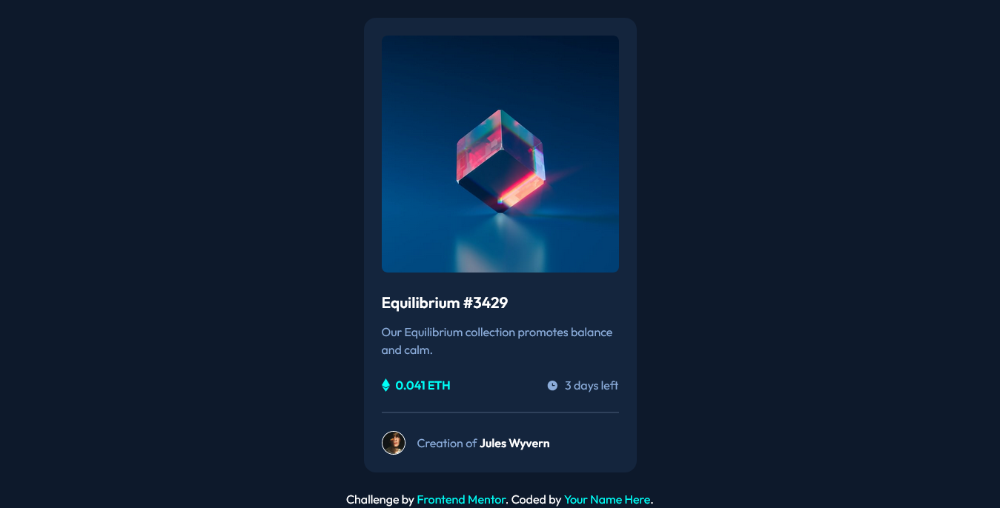
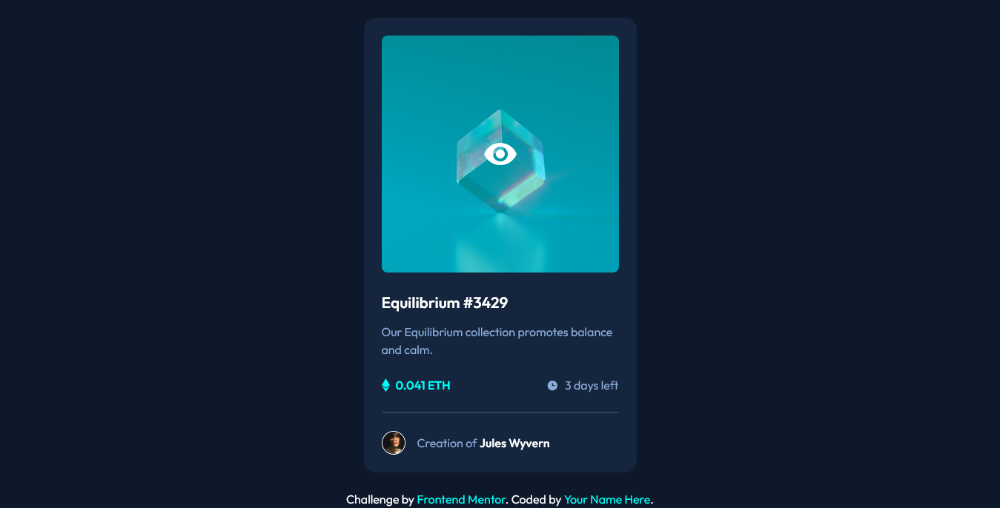

# Frontend Mentor - NFT preview card component solution

This is a solution to the [NFT preview card component challenge on Frontend Mentor](https://www.frontendmentor.io/challenges/nft-preview-card-component-SbdUL_w0U). 

## Table of contents

- [Overview](#overview)
  - [The challenge](#the-challenge)
  - [Screenshot](#screenshot)
  - [Links](#links)
- [My process](#my-process)
  - [Built with](#built-with)
  - [What I learned](#what-i-learned)
  - [Continued development](#continued-development)
  - [Useful resources](#useful-resources)
- [Author](#author)
- [Acknowledgments](#acknowledgments)

## Overview

### The challenge

Users should be able to:

- View the optimal layout depending on their device's screen size
- See hover states for interactive elements

### Screenshot

- My NFT preview card component


- Hovering on the image


### Links

- Solution URL: [Solution](https://www.frontendmentor.io/solutions/nft-preview-card-css-flexboxtransition-EJI1_f80BF)
- Live Site URL: [Live Site](https://fejiro001.github.io/nft-preview-card-component-main/)

## My process

### Built with

- Semantic HTML5 markup
- CSS custom properties
- Flexbox
- Mobile-first workflow

### What I learned

Learnt how to create an overlay on image when hovered over.

```css
.imgContainer {
    position: relative;
    cursor: pointer;
}

.imgOverlay {
    display: flex;
    justify-content: center;
    align-items: center;
    position: absolute;
    inset: 0;
    opacity: 0;
    border-radius: .5rem;
    height: 0%;
}

.imgContainer:hover .imgOverlay {
    height: 100%;
    transition: 500ms ease-in-out;
    opacity: 1;
    background-color: var(--cyan-opaque);
}
```

### Useful resources

- [Icon Overlay](https://www.w3schools.com/howto/howto_css_image_overlay_icon.asp) - This helped me 

## Author

- Frontend Mentor - [@Fejiro001](https://www.frontendmentor.io/profile/Fejiro001)
- Twitter - [@aberefejiro](https://twitter.com/aberefejiro)
